<div align="center">

# Malaysia Linguistics Lab

### Explore Malaysia's Living Languages

Discover the places, languages, voices and cultural stories that keep Malaysia's living languages alive.

<br>

[](https://malaysialinguisticlab.com)
[](LICENSE)
[](requirements.txt)

<br>

**[Visit the Live Lab →](https://malaysialinguisticlab.com)**
&nbsp;·&nbsp;
[GitHub](https://github.com/lowjieseng1810/malaysia-linguistics-lab)

<br>

<p><sub>01 — EXPLORE</sub></p>

**Begin with a place.**

An interactive World Explorer opens on Earth, then draws the journey toward Malaysia — the geographic starting point for language, community, and heritage.

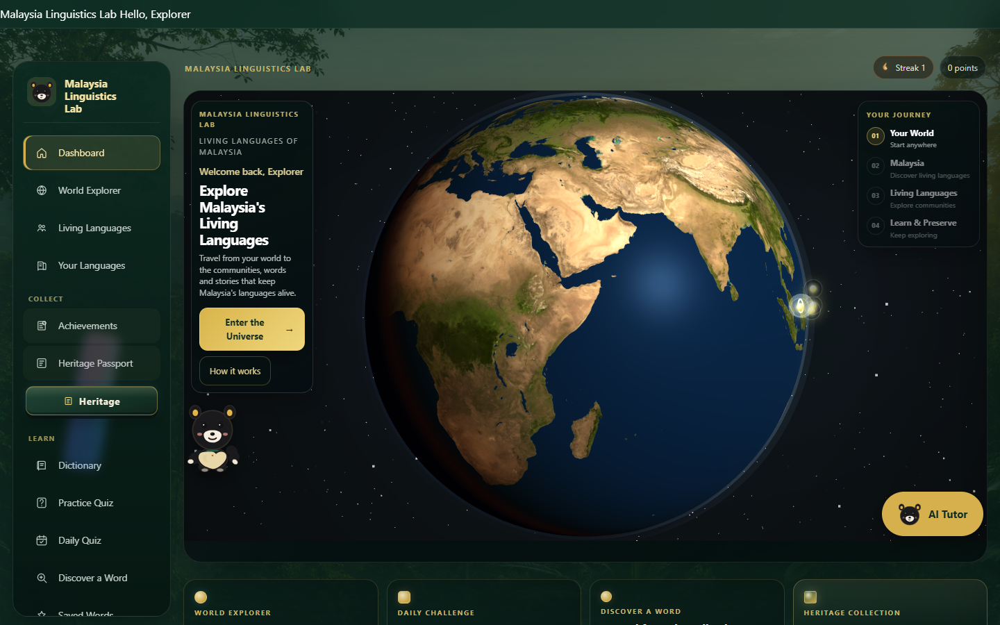

<p>
<strong>PLACE</strong> → <strong>LANGUAGE</strong> → <strong>COMMUNITY</strong> → <strong>CULTURE</strong> → <strong>LEARNING</strong> → <strong>PRESERVATION</strong>
</p>

<sub>Iban · Kadazan-Dusun · Bidayuh · Mah Meri</sub>

</div>

---

<div align="center">

## A journey, not a catalogue

</div>

<p align="center">
<em>Begin with a place.</em><br>
<em>Discover a language.</em><br>
<em>Hear a community.</em><br>
<em>Learn through context.</em><br>
<em>Preserve what you discover.</em>
</p>

Malaysia Linguistics Lab is an interactive platform for exploring, learning, hearing, and engaging with Malaysia's living minority and indigenous languages — and the cultures connected to them.

It is built as a field guide and a digital exhibition: you travel from the world to Malaysia, meet a language in its landscape, listen through community stories, then learn with lessons, a dictionary, quizzes, a heritage passport, and an optional AI tutor.

---

<div align="center">

## Why this Lab exists

</div>

Language is not only a list of words. It is tied to **place**, **people**, **culture**, **memory**, **identity**, and **community**.

Many of Malaysia's living languages have far less digital space than major world languages. This Lab gives four of them — **Iban**, **Kadazan-Dusun**, **Bidayuh**, and **Mah Meri** — a home where geography, heritage, and learning stay in the same frame.

The screenshots below are the product itself.

---

<div align="center">

<p><sub>02 — DISCOVER</sub></p>

## Discover Malaysia's linguistic landscape.

Signals on the map mark where language, community, and living heritage meet — Selangor, Sarawak, and Sabah — so exploration starts from geography, not from a generic menu.

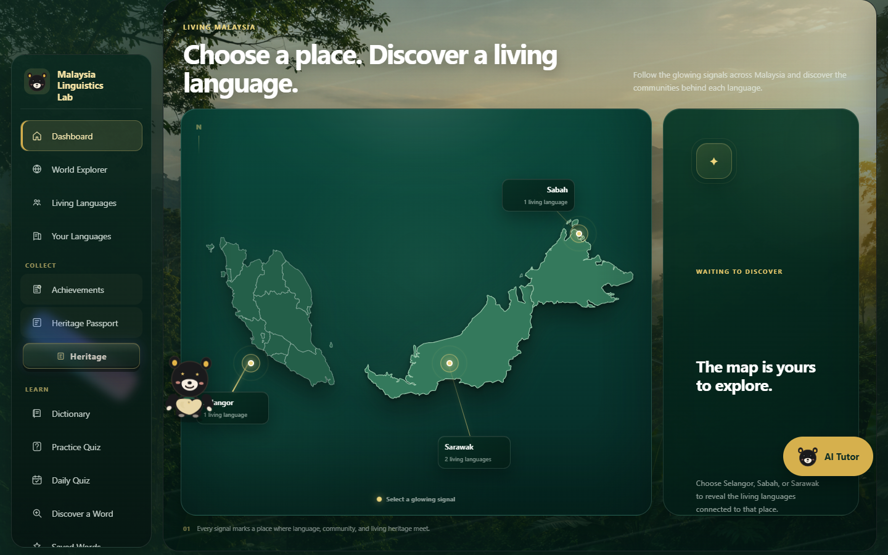

</div>

---

<div align="center">

<p><sub>03 — LISTEN</sub></p>

## Hear the living language.

Listen & Discover treats each language as a world to enter: community stories, cultural listening, and a path into learning — Iban, Kadazan-Dusun, Bidayuh, and Mah Meri, each held in its own landscape.

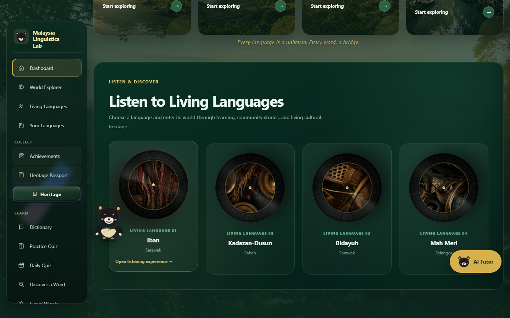

</div>

---

<table>
<tr>
<td width="50%" valign="top" align="center">

<p><sub>02 — DISCOVER</sub></p>

### Meet the languages.

Four living languages, introduced as places and communities rather than as a flat course list — ready to open into a deeper world.

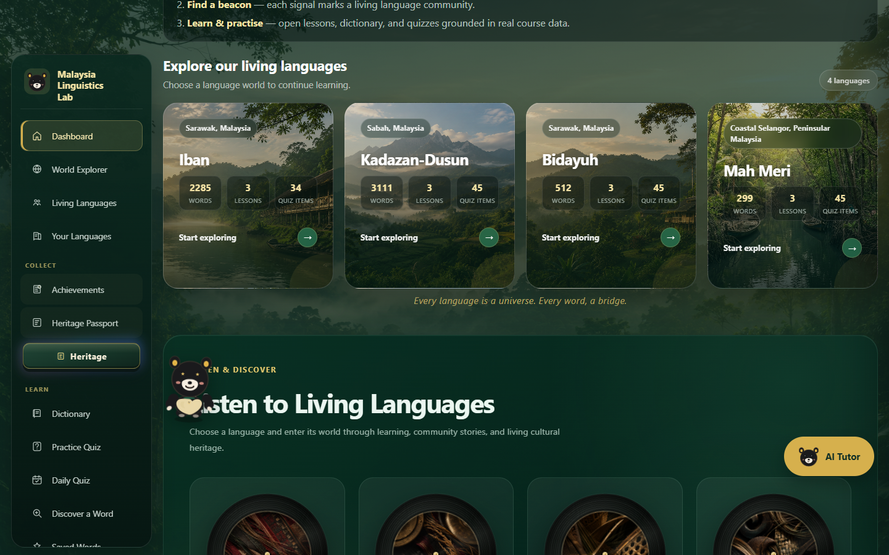

</td>
<td width="50%" valign="top" align="center">

<p><sub>02 — DISCOVER</sub></p>

### Go deeper.

Each language has a dedicated exploration page: region, community context, cultural media, and a clear way into lessons and vocabulary.

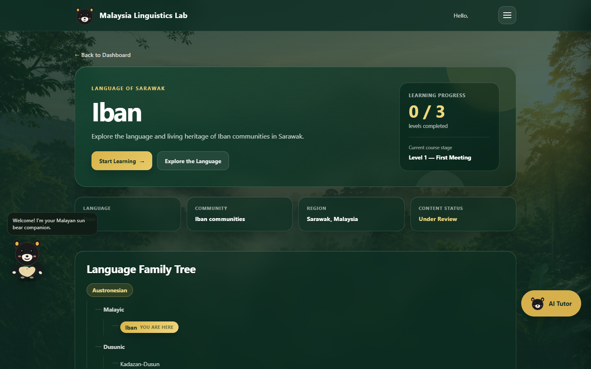

</td>
</tr>
</table>

---

<div align="center">

<p><sub>04 — LEARN</sub></p>

## Learn step by step.

Structured courses unfold in levels. Progress is saved to your account, later levels stay locked until you are ready, and the path stays tied to one living language at a time.

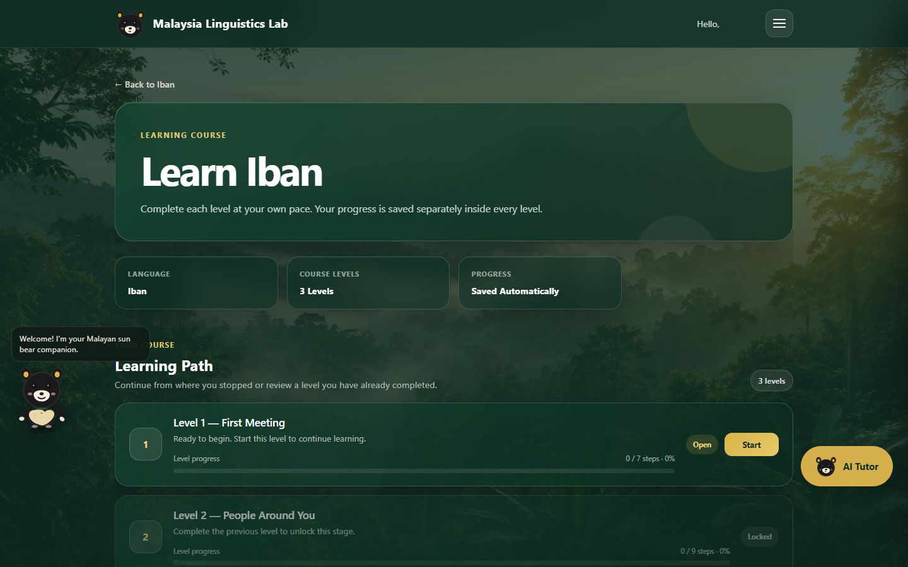

</div>

---

<div align="center">

<p><sub>05 — PRACTICE</sub></p>

## Turn discovery into practice.

Inside a lesson, exploration becomes encounter: vocabulary, discovery, response, and quiz-style steps — the same language, practiced in context.

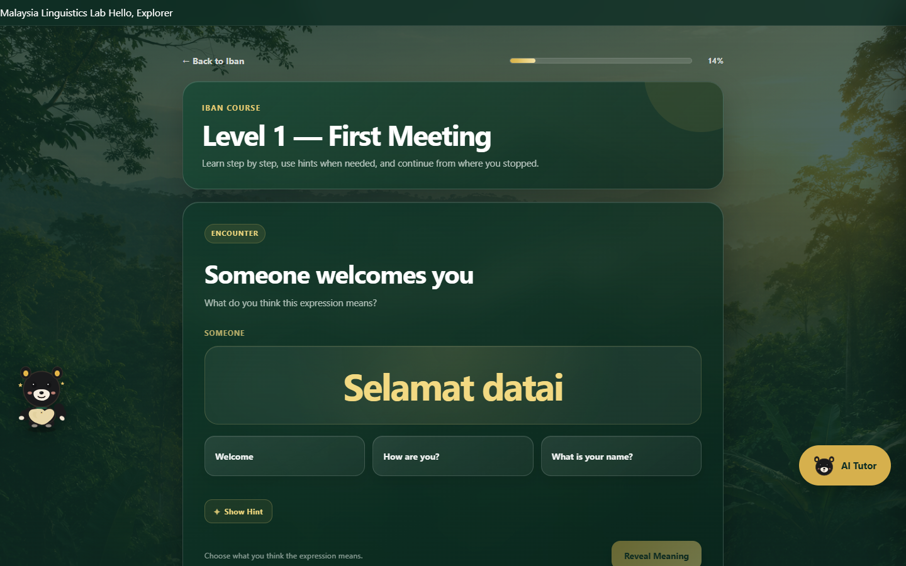

</div>

---

<table>
<tr>
<td width="50%" valign="top" align="center">

<p><sub>06 — UNDERSTAND</sub></p>

### A language-first dictionary.

Search verified vocabulary across the four languages. Filter by language, part of speech, and difficulty — then open a word in context, or save it for later.

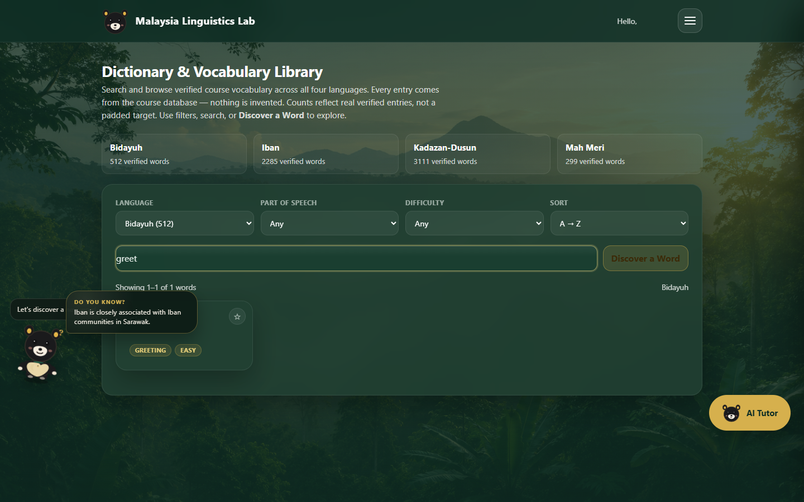

</td>
<td width="50%" valign="top" align="center">

<p><sub>05 — PRACTICE</sub></p>

### Make learning active.

Practice quizzes and a daily challenge use the same course vocabulary. Choose a language, level, and length — then check what you remember.

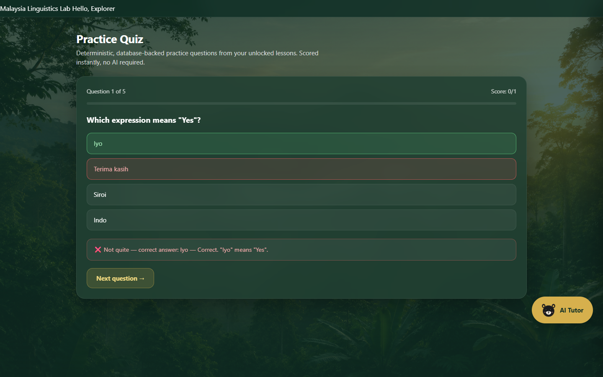

</td>
</tr>
</table>

---

<div align="center">

<p><sub>07 — PRESERVE</sub></p>

## Language, heritage and identity.

The Heritage Passport is a field notebook for the journey: world → Malaysia → place → language → words and lessons → heritage discovered. Each language becomes a stamp in a personal expedition record.

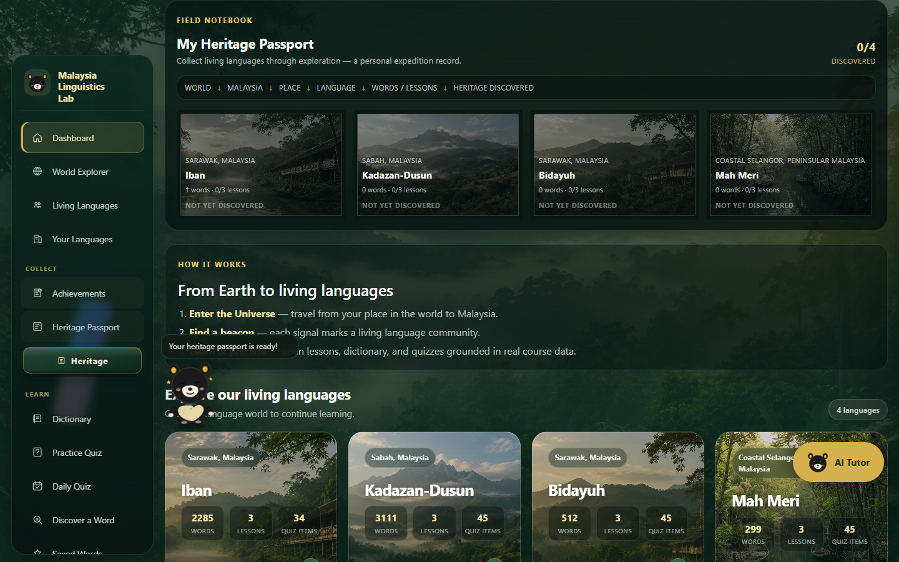

</div>

---

<table>
<tr>
<td width="50%" valign="top" align="center">

<p><sub>07 — PRESERVE</sub></p>

### Track the journey.

Achievements are collectible stamps earned through exploration, lessons, dictionary use, quizzes, and return visits — a visible record of the path, not a generic scoreboard.

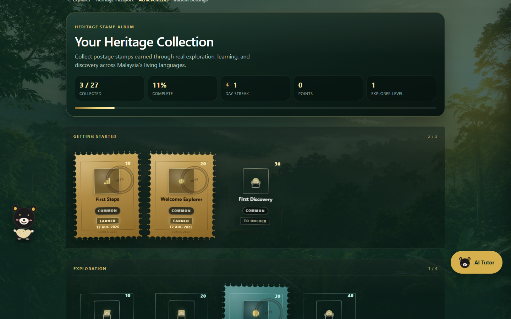

</td>
<td width="50%" valign="top" align="center">

<p><sub>06 — UNDERSTAND</sub></p>

### Compare living languages.

Place two of the Lab's languages side by side — region, community notes, and learning coverage — so difference and kinship can be seen together.

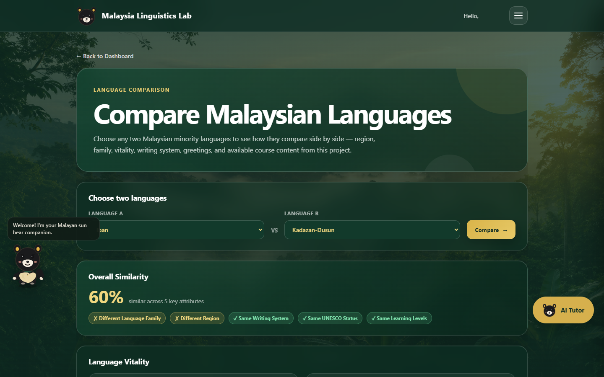

</td>
</tr>
</table>

---

<div align="center">

<p><sub>06 — UNDERSTAND</sub></p>

## Learn with an AI tutor.

An in-app companion can explain, give examples, quiz, talk about culture, or follow a free question — when an OpenAI key is configured. Lessons, dictionary, quiz, explorer, and heritage keep working without it.

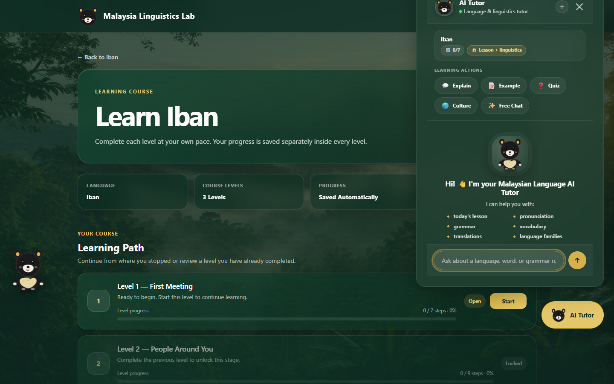

</div>

<br>

<table>
<tr>
<td width="50%" valign="top" align="center">

### Vocabulary in context.

Ask about a word, a greeting, or a grammar pattern and stay inside the language you are already exploring.

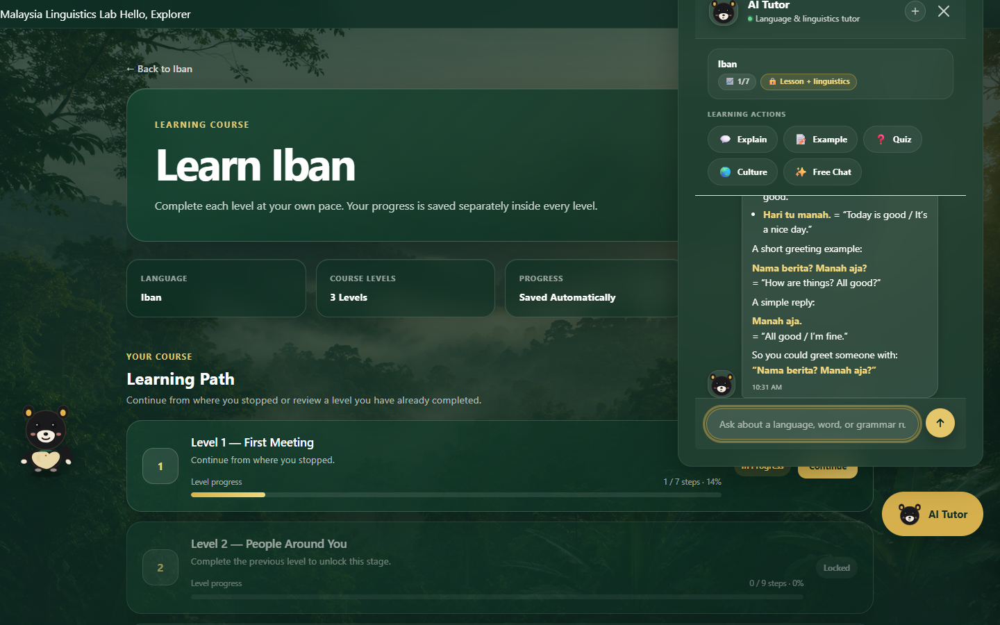

</td>
<td width="50%" valign="top" align="center">

### Culture-aware learning.

The tutor can sit beside cultural questions as well as drills — keeping community and custom in the same conversation as the lesson.

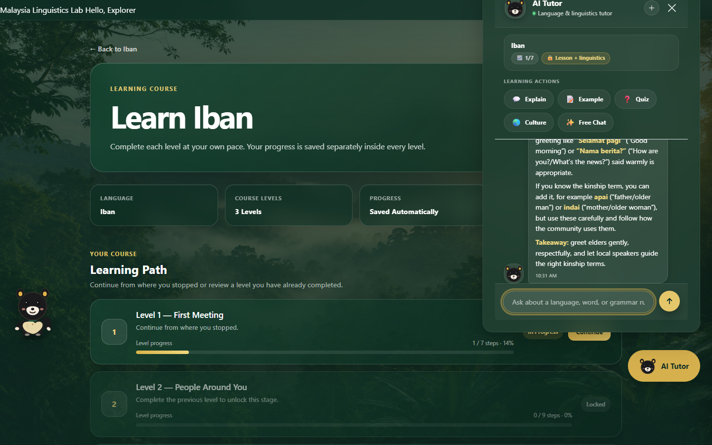

</td>
</tr>
</table>

---

<div align="center">

<p><sub>07 — PRESERVE</sub></p>

## Milestone unlocked.

Learning is worth celebrating.

When a genuine new achievement is earned, a heritage plaque drops into the Lab — a stamp, a date, a moment on the journey. Already-earned stamps stay in the collection; they do not interrupt the path again.

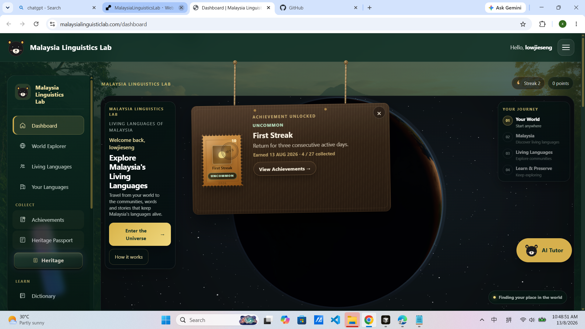

<br>

<sub>A moment in the exhibition — not another page in a grid.</sub>

</div>

---

<div align="center">

## Inside the Lab

A compact map of what the product actually offers.

</div>

<table>
<tr>
<td align="center" width="20%">🌏<br><strong>Explore</strong><br><sub>World Explorer & Malaysia map</sub></td>
<td align="center" width="20%">🗣️<br><strong>Languages</strong><br><sub>Iban, Kadazan-Dusun, Bidayuh, Mah Meri</sub></td>
<td align="center" width="20%">🎧<br><strong>Listen</strong><br><sub>Stories, culture, living context</sub></td>
<td align="center" width="20%">📚<br><strong>Learn</strong><br><sub>Levelled lessons, saved progress</sub></td>
<td align="center" width="20%">📖<br><strong>Dictionary</strong><br><sub>Searchable verified vocabulary</sub></td>
</tr>
<tr>
<td align="center">🧠<br><strong>Quiz</strong><br><sub>Practice & daily challenge</sub></td>
<td align="center">🏛️<br><strong>Heritage</strong><br><sub>Passport of discovered languages</sub></td>
<td align="center">🏆<br><strong>Progress</strong><br><sub>Achievements & journey stamps</sub></td>
<td align="center">🔄<br><strong>Comparison</strong><br><sub>Two languages, side by side</sub></td>
<td align="center">🤖<br><strong>AI Tutor</strong><br><sub>Optional OpenAI companion</sub></td>
</tr>
</table>

Saved Words, accounts (email/password, optional Google sign-in), and a profile with streak and quiz history sit alongside these surfaces.

---

<div align="center">

## 🎬 See the Lab in Action

**Malaysian Linguistics Lab — Explore Malaysia's Living Languages | Full Project Walkthrough**

A walkthrough of the Lab — from exploring Malaysia's linguistic landscape to discovering languages, learning through interactive content, exploring heritage, and interacting with the AI Tutor.

<br>

<a href="https://youtu.be/CQEM9NfSnSE?si=7ifRWHVtGFyY40pd">

</a>

<br>

**[▶ Watch on YouTube — 3:42](https://youtu.be/CQEM9NfSnSE?si=7ifRWHVtGFyY40pd)**

<sub>Full Project Walkthrough</sub>

</div>

---

<div align="center">

## Explore the Lab

### Discover Malaysia's living languages.

**[Visit the Live Lab →](https://malaysialinguisticlab.com)**

Create your own account on the demo. Hosted instances may pause after idle time; that is expected on a free public host, not a limit of the Lab itself.

</div>

---

## Technology

Visual first; stack second. Everything below is what this repository actually uses.

| Layer | In this project |
|---|---|
| Backend | Python, Flask, Jinja2 (`app.py`, `templates/`) |
| Frontend | HTML, CSS, JavaScript (`static/`) |
| World Explorer | Three.js (CDN) + `static/js/earth-globe.js` |
| Database | **SQLite** locally (`users.db`); **PostgreSQL** when `DATABASE_URL` is set |
| Auth | Flask-WTF (CSRF), Flask-Limiter, Authlib (optional Google OAuth) |
| AI Tutor | OpenAI Python client (`composer.py`) when `AI_TUTOR_API_KEY` / `OPENAI_API_KEY` is set |
| Production | Gunicorn (`requirements.txt`) |

Course lesson text lives in application data (`COURSE_DATA` in `app.py`). Dictionary, quiz, favorites, and related features use database tables seeded from that content. The AI Tutor is a separate path: chat needs an API key; the rest of the Lab does not.

---

## Getting Started

### Requirements

- Python 3.10+
- No external services for core learning features
- An OpenAI API key only if you want live AI Tutor replies

### Setup

```bash
git clone https://github.com/lowjieseng1810/malaysia-linguistics-lab.git
cd malaysia-linguistics-lab

python -m venv venv
# Windows
venv\Scripts\activate
# macOS / Linux
# source venv/bin/activate

pip install -r requirements.txt

# Windows
copy .env.example .env
# macOS / Linux
# cp .env.example .env
```

Edit `.env` and set at least:

```
SECRET_KEY=<a long random string>
```

Generate a key:

```bash
python -c "import secrets; print(secrets.token_hex(32))"
```

### Run locally

```bash
python app.py
```

Open [http://127.0.0.1:5000](http://127.0.0.1:5000).

On first run, `init_db()` creates schema and seeds course vocabulary, grammar, culture, and quiz content as needed.

### Database

- **Local development:** leave `DATABASE_URL` unset. The app uses SQLite at `<project_root>/users.db` (optional override: `DATABASE_PATH`).
- **Production:** set `DATABASE_URL` to a PostgreSQL URL. Render may provide `postgres://…`; the app normalizes it to `postgresql://…`.

Do not commit `.env` or real database URLs. Schema init is idempotent (`CREATE IF NOT EXISTS` / additive columns).

### Optional: Google sign-in

Prefer environment variables (required for Render / production):

```bash
GOOGLE_CLIENT_ID=your-client-id.apps.googleusercontent.com
GOOGLE_CLIENT_SECRET=your-client-secret
TRUST_PROXY=true
FORCE_HTTPS=true
```

Local development may instead use a gitignored `google_client_secret.json` in the project root. If neither env vars nor the JSON file are present, Google sign-in is disabled and the Google button is hidden.

Authorized redirect URIs should include:

- `https://malaysialinguisticlab.com/login/google/callback`
- `https://www.malaysialinguisticlab.com/login/google/callback`

Never commit OAuth secrets.

### Production notes

Do not expose the Flask development server publicly. Use a WSGI server (for example Gunicorn) behind TLS termination. For reverse-proxy HTTPS setups, see `TRUST_PROXY` and `FORCE_HTTPS` in [`.env.example`](.env.example).

---

## Environment Variables

Copy [`.env.example`](.env.example) to `.env` and supply your own values. Never commit real credentials.

| Variable | Required | Purpose |
|---|---|---|
| `SECRET_KEY` | **Yes** | Signs session cookies and CSRF tokens |
| `FLASK_DEBUG` | No | Debug mode (keep `false` on public hosts) |
| `FLASK_ENV` | No | `development` or `production` |
| `FLASK_HOST` | No | Bind host for `python app.py` |
| `DATABASE_PATH` | No | Override local SQLite file path |
| `DATABASE_URL` | No | PostgreSQL URL (enables Postgres instead of SQLite) |
| `TRUST_PROXY` | No | Honour `X-Forwarded-*` behind a reverse proxy |
| `FORCE_HTTPS` | No | Prefer HTTPS redirects / Secure cookies |
| `GOOGLE_CLIENT_ID` | No | Google OAuth client ID (production) |
| `GOOGLE_CLIENT_SECRET` | No | Google OAuth client secret (production) |
| `AI_TUTOR_API_KEY` | No | OpenAI key for AI Tutor chat (`OPENAI_API_KEY` also accepted) |
| `AI_TUTOR_MODEL` | No | Model name when the tutor is enabled |
| `DEBUG_TUTOR` | No | Enables `/api/tutor/debug/*` for logged-in users when `true` |

---

## AI Tutor

The AI Tutor is **optional**.

- With a valid `AI_TUTOR_API_KEY` (or `OPENAI_API_KEY`), chat replies are generated via OpenAI (`composer.py` / `tutor_service.py`).
- Without a key, the tutor reports that AI is unavailable; **dictionary, favorites, practice/daily quiz, lessons, progress, comparison, achievements, and World Explorer continue to work**.
- In-tutor quiz actions remain deterministic (`quiz_service.py`) and do not require the LLM for grading.

---

## Project Structure

```
app.py                 Flask app: routes, auth, course data, init_db
db.py                  SQLite / PostgreSQL connection layer
database.py            Content table seeding (vocabulary, grammar, culture, quiz)
quiz_service.py        Practice and daily quiz session logic
tutor_service.py       AI Tutor chat orchestration
composer.py            OpenAI client for tutor replies
achievements.py        Achievement definitions and evaluation
templates/             Jinja2 pages
static/                CSS, JavaScript, product imagery
data/vocabulary        Curated vocabulary packs
tests/                 Focused auth, CSRF, rate-limit, and achievement tests
requirements.txt       Python dependencies
.env.example           Environment variable template (no secrets)
LICENSE                MIT License
```

---

## Testing

```bash
python -m unittest tests.test_auth_csrf tests.test_login_rate_limit tests.test_achievements_notify -v
```

Practical manual checks:

1. Create `.env` from `.env.example`, set `SECRET_KEY`, install dependencies, and run `python app.py`.
2. Exercise dictionary, favorites, practice/daily quiz, a lesson level, compare, achievements, and profile while logged in.
3. Confirm the AI Tutor shows an unavailable state when no API key is set, and replies when a valid key is configured.

---

## Known Limitations

- The AI Tutor depends on OpenAI availability and quota when enabled; without a key, only the tutor chat is limited.
- Vocabulary and course coverage are curated for the four supported languages and are not an exhaustive lexicon.
- Linguistic metadata on comparison/explorer surfaces is general reference material and may be refined over time.
- The 3D World Explorer needs WebGL; unsupported devices see a fallback and can still use other features.
- Free hosted demos may sleep when idle and are not a substitute for your own deployment.

Forgot-password reset links are written to the server console only in development (`FLASK_ENV=development` or `FLASK_DEBUG=true`). Production does not send reset email out of the box.

---

## Contributing

Issues and pull requests are welcome.

Please keep course content and the optional AI Tutor as separate concerns, avoid committing secrets (`.env`, `google_client_secret.json`, local `users.db`), and prefer small, reviewable changes. See [`AGENTS.md`](AGENTS.md) for codebase conventions.

---

<div align="center">

## License

This project is licensed under the **[MIT License](LICENSE)**.

<br>

**[Visit the Live Lab →](https://malaysialinguisticlab.com)**

<sub>Malaysia Linguistics Lab — a digital exhibition of living languages.</sub>

</div>
